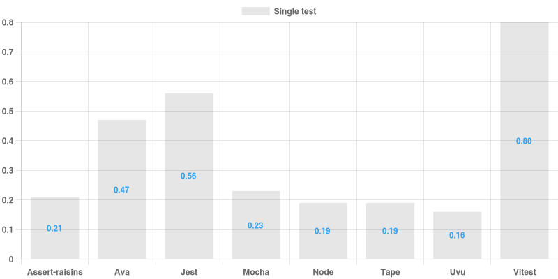
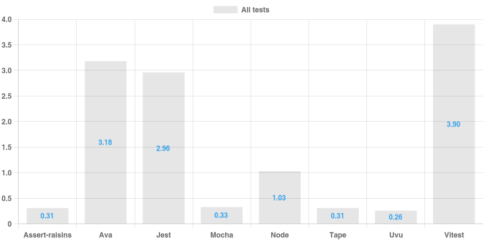

# Node test runners performance comparison

Why does this exist? I was experimenting with a test runner that requires test files "statically" (via `node --require`) and wanted to see if this approach improves test start up time. I wanted to compare the aformentioned test runned - [assert-raisins](https://github.com/artemave/assert-raisins) - with [mocha](https://github.com/mochajs/mocha), because mocha (just like any other test runner I looked into) requires test files "dynamically", iterating over glob results.

Once test framework was in place, I added a bunch more popular test runners into the mix.

To generate sizable "import" load, I took a large Node project - [Sails](https://sailsjs.com/) - and for each `.js` file in `lib` I generated a dumb test file (in each contending tech) that requires that Sails file.

### Results on my machine (seconds)

<p align="center">
  
</p>
<p align="center">
  
</p>

### Raw results

| runner | real | user | system |
| ------ | ----:| ----:| ------:|
|Node all tests|1.05|10.51|2.81|
|Node single test|0.20|0.19|0.05|
|Jest all tests|3.17|33.88|4.82|
|Jest single test|0.58|0.61|0.12|
|Mocha all tests|0.34|0.35|0.06|
|Mocha single test|0.25|0.26|0.05|
|Tape all tests|0.30|0.30|0.07|
|Tape single test|0.20|0.22|0.04|
|Vitest all tests|1.20|7.90|2.01|
|Vitest single test|0.85|3.34|1.37|
|Uvu all tests|0.26|0.26|0.06|
|Uvu single test|0.17|0.16|0.04|
|Ava all tests|3.16|34.50|5.42|
|Ava single test|0.48|0.51|0.11|
|Assert-raisins all tests|0.32|0.31|0.08|
|Assert-raisins single test|0.21|0.21|0.05|

## Usage

```bash
yarn install
./run_tests
```

This generates charts and `results.md` file with a table of results (see above).
