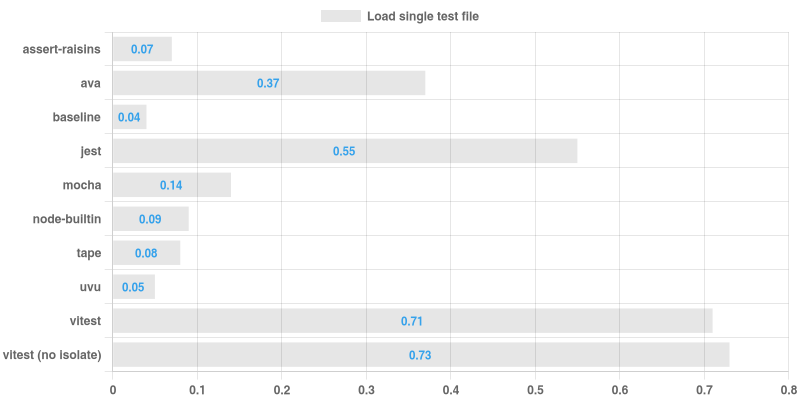
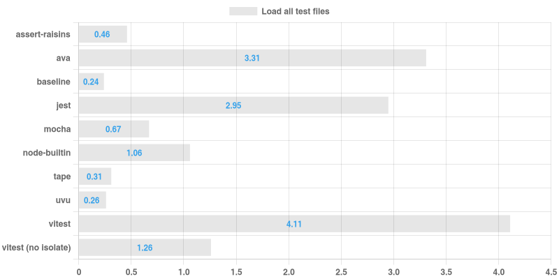
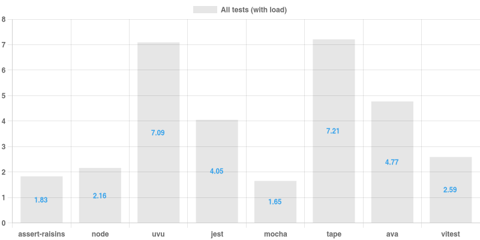

# Node test runners performance comparison

I've been toying with my [own test runner](https://github.com/artemave/assert-raisins), and one of the main ideas was to make it as fast as possible. What better way to assert that, than to compare with other test runners? In the end, I think these benchmarks are way more interesting and useful than my test runner, but it's still there, among the contenders.

## Methodology

The goal is to establish how much overhead a test runner ensues. There are three facets to that (scenarios):
1. how long does it take to load a single test file
1. how long does it take to load all test files
1. how long does it take to run all test files

To support those there are two types of tests:
- a blank test that does nothing (used in for 1 and 2)
- a test file with some async and cpu load (used for 3)

A set of test files is generated for each test runner and each test type. To generate a set, I take every `.js` file in `./node_modules/sails/lib` ([Sails](https://sailsjs.com/) is just a project with a lot of files in this context). To be more realistic, every test file imports its `lib` counterpart.

Scenarios 1 and 2 contain a "baseline" column, which is just a bare node running the same payload.

> Scenario 3 involves concurrency, so picking the right "baseline" technology is not straight forward and hence remains a TODO.

#### Contenders

- [node built-in test runner](https://nodejs.org/api/test.html)
- [mocha](https://mochajs.org/)
- [jest](https://jestjs.io/)
- [vitest](https://vitest.dev/)
- [tape](https://github.com/tape-testing/tape)
- [ava](https://github.com/avajs/ava)
- [uvu](https://github.com/lukeed/uvu)
- [assert-raisins](https://github.com/artemave/assert-raisins)

### Results on my machine (seconds)

<p align="center">
  
</p>
<p align="center">
  
</p>
<p align="center">
  
</p>

#### Notes

Neither Tape nor Uvu support concurrent testing. You can see how they fare better than others in the first two scenarios, but fall behind hopelessly in the third one.

## Usage

```bash
npm install
node ./run_benchmarks.js
```

This generates chart images (references in this readme) and [results.json](./results.json) file with raw results.

I use [grip](https://github.com/joeyespo/grip) to preview markdown locally.
