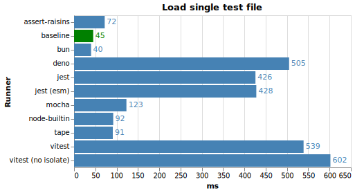
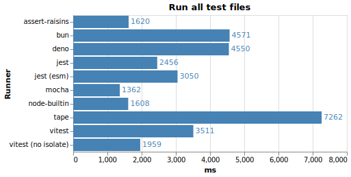

# Node test runners performance comparison

I have been experimenting with my [own test runner](https://github.com/artemave/assert-raisins), and one of the main ideas was to make it as fast as possible. What better way to assert that than to compare it with other test runners? In the end, I found these benchmarks interesting in their own right, hence this repo.

## Methodology

The goal is to establish how much overhead a test runner incurs. There are three facets to that (scenarios):
1. how long it takes to load a single test file
2. how long it takes to load all test files
3. how long it takes to run all test files

To support these, there are two types of tests:
- a blank test that does nothing (used for 1 and 2)
- a test file with some async and CPU load (used for 3)

A set of test files is generated for each test runner and each test type. To generate a set, for every `.js` file in `./node_modules/sails/lib` ([Sails](https://sailsjs.com/) is just a project with lots of files), a corresponding "test" file is generated. In order to simulate "import" load, every test file imports its `lib` counterpart.

Scenarios 1 and 2 contain a "baseline" column, which is just bare node (23.8.0) running the same payload.

> Scenario 3 involves concurrency, so picking the right "baseline" technology is not straightforward and hence remains a TODO.

#### Contenders

- [node built-in test runner](https://nodejs.org/api/test.html)
- [mocha](https://mochajs.org/)
- [jest](https://jestjs.io/)
- [vitest](https://vitest.dev/)
- [tape](https://github.com/tape-testing/tape)
- ~~[ava](https://github.com/avajs/ava)~~ (disabled atm because it's hanging on node > 21 🤷)
- [assert-raisins](https://github.com/artemave/assert-raisins)

Also for good measure:

- [deno test](https://docs.deno.com/runtime/fundamentals/testing/)
- [bun test](https://bun.sh/docs/cli/test)

### Results on my machine (seconds)

<p align="center">
  
</p>
<p align="center">
  
</p>
<p align="center">
  
</p>

#### Notes

- Tape does not support concurrent testing. You can see how it performs better than the others to "load all tests" but falls behind hopelessly when it comes to "running all all tests".
- Bun also doesn't support parallel testing ([as of this writing](https://github.com/oven-sh/bun/issues/5585)), but it nevertheless fares better than tape (and as good as deno that does!). _Maybe_ their implementation of `crypto.randomBytes` (used to generate cpu load) is faster than that of node/deno?

## Usage

```bash
npm install
node ./run_benchmarks.js
```

This generates test sets, runs benchmarks, and generates chart images (sourced in this readme), and also [results.json](./results.json) file with raw results.

I then use [grip](https://github.com/joeyespo/grip) to preview the readme with the updated charts locally.
